# HAATO Software Architecture

## Overview

HAATO is an event-driven plugin-based system integrating Python mission logic with X-Plane flight simulation. The architecture enables human-AI collaboration for fire management missions through dataref-based message passing.

**Architecture Type:** Distributed event-driven system with Python-Lua integration
**Communication:** Bidirectional UDP via XPlaneConnectX and X-Plane datarefs
**Primary Pattern:** Plugin architecture with external Python control

---

## System Architecture Diagram

```mermaid
graph TB
    subgraph "Human Pilot Interface"
        A1[Joystick/Controls<br/>trigger, mic button]
        A2[G1000 PFD Display<br/>Classification UI]
        A3[G1000 MFD Display<br/>Map & Commands]
    end

    subgraph "X-Plane Core"
        B1[Standard Datarefs<br/>sim/flightmodel/*<br/>sim/time/*]
        B2[Custom Datarefs<br/>custom/haato/*]
        B3[Physics Engine]
    end

    subgraph "Lua Scripts (In X-Plane)"
        C1[FlyWithLua scripts<br/>datarefs, effects, utilities]
        C2[dump_water.lua<br/>Water Mechanics]
        C3[HAATO assets<br/>images and sounds]
        C4[end_mission.lua<br/>Mission Completion]
        C5[custom_datarefs.lua<br/>Dataref Definitions]
    end

    subgraph "XPPython3 Plugin (In X-Plane)"
        D1[PI_firemission.py<br/>G1000 Overlay<br/>Input Capture]
    end

    subgraph "Python Mission System (External)"
        E1[XPlaneConnectX<br/>UDP Socket Communication]
        E2[MissionManager<br/>FireWatchMM]
        E3[Wingman Agent<br/>FireWatchWingman]
        E4[MessageQueue<br/>Human-AI Messages]
        E5[WoZ GUI<br/>Tkinter Interface]
        E6[DataLogger<br/>CSV Logging]
        E7[Voice and audio utilities]
    end

    subgraph "Utilities"
        F1[GeoUtils<br/>Vectorized Calculations]
        F2[MissionTimer<br/>Frame Rate Control]
        F3[SimMode<br/>Testing Without X-Plane]
    end

    %% Human interactions
    A1 --> B1
    A2 --> D1
    A3 --> D1

    %% XPPython3 Plugin
    D1 -.->|Read/Write| B2

    %% Lua Scripts
    C1 -.->|Read| B2
    C2 -.->|Read/Write| B2
    C3 -.->|Read/Write| B2
    C4 -.->|Read| B2
    C5 -.->|Initialize| B2

    %% Python to X-Plane
    E1 <-->|UDP getDREF/sendDREF| B1
    E1 <-->|UDP getDREF/sendDREF| B2
    E1 -->|sendPOSI wingman| B3

    %% Mission System Flow
    E2 -->|get_observation| E3
    E3 -->|act returns HSA| E2
    E2 <-->|poll/publish| E4
    E2 --> E1
    E5 -.->|Read via XPC| B2
    E5 -.->|Write commands| B2
    E7 -.->|Write triggers| B2
    E7 -.->|Read mic status| B2
    E2 --> E6

    %% Utilities
    E3 --> F1
    E2 --> F2
    E1 -.->|Can replace| F3

    %% Styling
    classDef human fill:#e1f5ff,stroke:#0066cc,stroke-width:2px
    classDef xplane fill:#fff4e1,stroke:#cc6600,stroke-width:2px
    classDef lua fill:#f0e1ff,stroke:#6600cc,stroke-width:2px
    classDef python fill:#e1ffe1,stroke:#00cc66,stroke-width:2px
    classDef util fill:#ffe1e1,stroke:#cc0000,stroke-width:2px

    class A1,A2,A3 human
    class B1,B2,B3 xplane
    class C1,C2,C3,C4,C5,D1 lua
    class E1,E2,E3,E4,E5,E6,E7 python
    class F1,F2,F3 util
```



**Legend:**
- 🔵 **Blue**: Human pilot interfaces
- 🟡 **Orange**: X-Plane core systems
- 🟣 **Purple**: Lua scripts and XPPython3 plugin (running in X-Plane)
- 🟢 **Green**: External Python mission system
- 🔴 **Red**: Utility classes/modules

**Data Flow:**
- Solid arrows (→): Direct function calls or data passing
- Dotted arrows (-.->): Dataref-based communication

---

## Complete Dataref Reference

### Mission Control Datarefs

| Dataref | Type | Purpose | Read By | Write By |
|---------|------|---------|---------|----------|
| `custom/haato/mission_status` | Float | Mission state: 0=running, 1=complete, -1=failed | Lua scripts, CombinedGUI | `MissionManager.__init__()`, `FireWatchMM.step()` |
| `custom/haato/mission_time_left` | Float | Remaining mission time (seconds) | WoZ GUI, PI_firemission | `FireWatchMM.step()` |
| `custom/haato/icons_visible` | Float | Enable 3D target rendering (0.0/1.0) | FlyWithLua scripts | `run_mission.py` |
| `custom/haato/announcement_to_show` | Float | Announcement type: 0=welcome, 1=end, 99=none | draw_targets_dynamic.lua | `FireWatchMM.reset()`, `FireWatchMM.step()` |

### Human-AI Communication Datarefs

| Dataref | Type | Purpose | Read By | Write By |
|---------|------|---------|---------|----------|
| `custom/haato/command_from_human` | Float | Human command to wingman: 0-7=go to target, 8=follow, 12=no command | `FireWatchMM._poll_human_messages()`, `FireWatchWingman.act()` | WoZ GUI, PI_firemission |
| `custom/haato/request_response` | Float | Response to help request: -1=reject, 0=none, 1=accept | `FireWatchMM._poll_human_messages()` | CombinedGUI |
| `custom/haato/help_request` | Float | Wingman requesting help: 0-7=target ID, 99=no request | WoZ GUI, PI_firemission | `FireWatchMM.step()` via `wingman.act()` |
| `custom/haato/wingman_status` | Float | Encoded status message (0-59) | WoZ GUI, PI_firemission | `FireWatchMM.step()` via message codes |
| `custom/haato/id_request_response` | Float | Classification response: 0=none, 1=auto, 1.0=moderate, 2.0=severe | `FireWatchMM._poll_human_messages()` | PI_firemission |
| `custom/haato/agent_id_request` | Float | Agent requesting classification: 0-7=target ID, 99=none | PI_firemission | `FireWatchMM.step()` via `wingman.act()` |

### Wingman Configuration Datarefs

| Dataref | Type | Purpose | Read By | Write By |
|---------|------|---------|---------|----------|
| `custom/haato/taskpriority_spotunknown` | Float | Priority for spotting unknown fires: 0=highest, 99=disabled | `FireWatchWingman.policy_combined()` | WoZ GUI, PI_firemission |
| `custom/haato/taskpriority_handlemoderate` | Float | Priority for handling moderate fires | `FireWatchWingman.policy_combined()` | WoZ GUI, PI_firemission |
| `custom/haato/taskpriority_handlesevere` | Float | Priority for handling severe fires | `FireWatchWingman.policy_combined()` | WoZ GUI, PI_firemission |
| `custom/haato/set_wingman_greedy` | Float | Enable greedy mode (closest first): 0/1 | `FireWatchWingman.policy_combined()` | WoZ GUI, PI_firemission |
| `custom/haato/auto_spot` | Float | Auto-classify fires: 0=off, 1=on | `FireWatchMM.step()`, `FireWatchWingman.policy_combined()` | WoZ GUI, PI_firemission |
| `custom/haato/can_request` | Float | Allow wingman help requests: 0/1 | `FireWatchWingman.policy_combined()` | CombinedGUI |

### Wingman State Datarefs

| Dataref | Type | Purpose | Read By | Write By |
|---------|------|---------|---------|----------|
| `custom/haato/wingman_lat` | Float | Wingman latitude (degrees) | draw_targets_dynamic.lua, CombinedGUI | `FireWatchMM.step()` |
| `custom/haato/wingman_long` | Float | Wingman longitude (degrees) | draw_targets_dynamic.lua, CombinedGUI | `FireWatchMM.step()` |
| `custom/haato/wingman_alt` | Float | Wingman altitude (meters MSL) | draw_targets_dynamic.lua, CombinedGUI | `FireWatchMM.step()` |
| `custom/haato/wingman_hdg` | Float | Wingman current heading (degrees true) | draw_targets_dynamic.lua, CombinedGUI | `FireWatchMM.step()` |
| `custom/haato/wingman_spd` | Float | Wingman current speed (knots) | CombinedGUI | `FireWatchMM.step()` |
| `custom/haato/wingman_goal_hdg` | Float | Wingman desired heading (degrees true) | CombinedGUI | `FireWatchMM.step()` via `wingman.act()` |
| `custom/haato/wingman_goal_spd` | Float | Wingman desired speed (knots) | CombinedGUI | `FireWatchMM.step()` via `wingman.act()` |
| `custom/haato/wingman_goal_alt` | Float | Wingman desired altitude (meters MSL) | CombinedGUI | `FireWatchMM.step()` via `wingman.act()` |

### Target Status Datarefs (Per Target 0-7)

| Dataref | Type | Purpose | Read By | Write By |
|---------|------|---------|---------|----------|
| `custom/haato/target{0-7}status` | Float | Target status: 0=unknown, 1=spotted, 1.01-1.99=in progress, 2=complete | FlyWithLua scripts, PI_firemission | `FireWatchMM._process_target_handling()`, `FireWatchMM.reset()`, PI_firemission, WoZ GUI |
| `custom/haato/target{0-7}classification` | Float | Fire severity: 0=unclassified, 1=moderate, 2=severe | FlyWithLua scripts, PI_firemission, `FireWatchMM.step()` | PI_firemission, WoZ GUI, `FireWatchMM.step()` (auto-spot) |

**Note:** There are 8 targets (0-7), so this represents 16 datarefs total (8 status + 8 classification).

### Human Interaction Datarefs

| Dataref | Type | Purpose | Read By | Write By |
|---------|------|---------|---------|----------|
| `custom/haato/human_in_range_of_target` | Float | Target ID human is near: 0-7=target ID, 99=none | PI_firemission | `FireWatchMM._process_target_handling()` |
| `custom/haato/trigger_pulled` | Float | Water dump button state | `FireWatchMM._process_target_handling()` | dump_water.lua |
| `custom/haato/water_remaining` | Float | Water capacity remaining | WoZ GUI, PI_firemission | dump_water.lua |
| `custom/haato/mic_pressed` | Float | Mic button for radio acknowledgment | voice/audio utilities | cockpit input |
| `custom/haato/play_radiocall` | Float | Audio trigger: 1-3=call types, 4=ack, 0=stop | radio_calls.lua | `RadioCallManager.step()` |
| `sim/joystick/fire_key_is_down` | Int | Fire button state (standard X-Plane) | `FireWatchMM._process_target_handling()` | X-Plane core |

### Standard X-Plane Datarefs (Read by Python)

| Dataref | Purpose | Read By |
|---------|---------|---------|
| `sim/flightmodel/position/latitude` | Human aircraft latitude | `FireWatchMM.step()` |
| `sim/flightmodel/position/longitude` | Human aircraft longitude | `FireWatchMM.step()` |
| `sim/flightmodel/position/elevation` | Human aircraft altitude (meters MSL) | `FireWatchMM.step()` |
| `sim/flightmodel/position/true_psi` | True heading (degrees) | `FireWatchMM.step()` |
| `sim/flightmodel/position/true_phi` | Roll angle (degrees) | `FireWatchMM.step()` |
| `sim/flightmodel/position/true_theta` | Pitch angle (degrees) | `FireWatchMM.step()` |
| `sim/flightmodel/position/local_vx` | Velocity X (m/s local frame) | `FireWatchMM.step()` |
| `sim/flightmodel/position/local_vy` | Velocity Y (m/s local frame) | `FireWatchMM.step()` |
| `sim/flightmodel/position/local_vz` | Velocity Z (m/s local frame) | `FireWatchMM.step()` |
| `sim/flightmodel/position/Prad` | Roll rate (rad/s) | `FireWatchMM.step()` |
| `sim/flightmodel/position/Qrad` | Pitch rate (rad/s) | `FireWatchMM.step()` |
| `sim/flightmodel/position/Rrad` | Yaw rate (rad/s) | `FireWatchMM.step()` |
| `sim/time/paused` | Simulation paused state | `run_mission.py` |

---

## Base Classes and Utilities

### MissionManager (Abstract Base Class)

**File:** `utility/base_classes.py`

**Purpose:** Provides core mission infrastructure and abstracts common mission operations.

**Abstract Methods (Must Implement):**
- `reset()` - Initialize/reset mission state
- `step()` - Main mission loop iteration
- `get_state()` - Return current mission state
- `get_observation()` - Return observation for agent

**Properties Provided:**
- `user_id` - Mission identifier
- `xpc` - XPlaneConnectX instance for dataref I/O
- `targets` - List of Target objects
- `wingman` - Wingman agent instance
- `mission_timer` - MissionTimer instance
- `target_lats`, `target_longs`, `target_alts` - Pre-allocated numpy arrays for vectorized calculations

**Utility Methods:**
```python
safe_get_dref(path: str, default_value: float = 0.0) -> float
    # Safe dataref read with fallback value

_calculate_range(lat1: float, lon1: float, lat2: float, lon2: float) -> float
    # Calculate distance between two positions (meters)
```

**What FireWatchMM Inherits:**
- Dataref path constants (e.g., `DREF_HUMAN_LAT`, `DREF_MISSION_STATUS`)
- Safe dataref access with error handling
- Pre-allocated arrays for performance
- Consistent mission lifecycle structure

---

### Wingman (Abstract Base Class)

**File:** `utility/base_classes.py`

**Purpose:** Provides navigation capabilities and decision-making framework for AI agents.

**Abstract Methods (Must Implement):**
- `act(observation: dict, commands: list) -> dict` - Main decision-making method

**Properties Provided:**
- `lat`, `long`, `alt` - Current position
- `hdg`, `spd` - Current heading and speed
- `max_speed` - Aircraft performance limit
- `xpc` - XPlaneConnectX instance
- `mm` - Reference to parent MissionManager

**Navigation Helper Methods:**
```python
_calc_hsa_to_target(target_lat: float, target_long: float, target_alt: float) -> tuple
    # Calculate heading/speed/altitude to fly to a target
    # Returns: (heading, speed, altitude)

_calc_hsa_to_human_intercept(human_lat: float, human_long: float, human_alt: float,
                              human_hdg: float, human_spd: float) -> tuple
    # Calculate intercept course to join formation with human
    # Returns: (heading, speed, altitude)

_calc_hsa_holding_pattern(center_lat: float, center_long: float, center_alt: float,
                          radius: float = 1000.0) -> tuple
    # Calculate heading/speed/altitude for circular holding pattern
    # Returns: (heading, speed, altitude)
```

**What FireWatchWingman Inherits:**
- Pre-built navigation algorithms (target intercept, formation join, holding)
- Geospatial utilities via GeoUtils
- HSA (Heading/Speed/Altitude) calculation framework
- Position update handling

---

### Utility Classes

#### GeoUtils

**File:** `utility/base_classes.py`

**Purpose:** Vectorized geospatial calculations for performance.

**Key Methods:**
```python
@staticmethod
haversine_distance(lat1: np.ndarray, lon1: np.ndarray,
                   lat2: np.ndarray, lon2: np.ndarray) -> np.ndarray
    # Calculate distances between arrays of positions
    # Returns: distances in meters (vectorized)

@staticmethod
calculate_bearing(lat1: float, lon1: float, lat2: float, lon2: float) -> float
    # Calculate initial bearing from point 1 to point 2
    # Returns: bearing in degrees (0-360)

@staticmethod
project_position(lat: float, lon: float, bearing: float, distance: float) -> tuple
    # Project a position given bearing and distance
    # Returns: (new_lat, new_lon)
```

**Performance:** 5-10x speedup vs. iterative calculations using numpy vectorization.

---

#### Target

**File:** `utility/base_classes.py`

**Purpose:** Data class representing a fire target.

**Properties:**
- `lat`, `long`, `alt` - Position
- `type` - Target type identifier
- `spotted` - Boolean, has been detected
- `handled` - Boolean, has been extinguished
- `progress` - Float, handling completion percentage
- `human_in_range_time` - Timestamp when human entered range
- `wingman_in_range_time` - Timestamp when wingman entered range

---

#### MissionTimer

**File:** `utility_classes.py:4-67`

**Purpose:** Manages mission timing and frame rate control.

**Key Methods:**
```python
get_dt_and_wait() -> float
    # Returns delta time since last call
    # Sleeps to maintain target FPS (default 30)
    # Returns: dt in seconds

get_mission_elapsed_time() -> float
    # Returns total mission time elapsed
    # Returns: time in seconds

reset()
    # Reset timer to zero
```

**Usage:** Ensures consistent simulation step rate independent of Python execution speed.

---

#### SimMode

**File:** `utility_classes.py:70-165`

**Purpose:** Simulates X-Plane dataref system for testing without X-Plane.

**Key Methods:**
```python
getDREF(path: str) -> float
    # Returns simulated dataref value from dictionary

sendDREF(path: str, value: float) -> None
    # Stores dataref value in dictionary

getPOSI() -> list
    # Returns simulated aircraft position [lat, lon, alt, pitch, roll, yaw, gear]

sendPOSI(position: list) -> None
    # Stores simulated aircraft position
```

**Usage:** Allows mission testing and debugging without running X-Plane.

---

#### MessageQueue

**File:** `message_queue.py:4-82`

**Purpose:** In-memory FIFO queue for human-AI communication.

**Key Methods:**
```python
add_message(message: Message) -> None
    # Add message to queue with timestamp

get_messages_for_recipient(recipient: str, mark_delivered: bool = True) -> list
    # Retrieve messages for specific recipient
    # Optionally mark as delivered

has_undelivered_messages(recipient: str) -> bool
    # Check if recipient has pending messages
```

**Message Types:**
- `command` - Human commanding wingman to target
- `request` - Wingman requesting help
- `response` - Human responding to request
- `status` - Wingman status update

---

#### DataLogger

**File:** `data_logger.py:5-98`

**Purpose:** CSV-based logging for mission analysis.

**Key Methods:**
```python
log_step(timestamp: float, human_state: dict, wingman_state: dict,
         targets: list, messages: list) -> None
    # Log single mission timestep

log_event(event_type: str, details: dict) -> None
    # Log discrete event (radio call, classification, etc.)

close() -> None
    # Flush and close log files
```

**Output Files:**
- `mission_data_{timestamp}.csv` - Per-step telemetry
- `events_{timestamp}.csv` - Discrete events

---

## Key Architectural Patterns

### 1. Message-Passing Architecture
All Python ↔ X-Plane communication uses datarefs as shared memory:
- Python writes to datarefs → Lua/XPPython3 reads
- Lua/XPPython3 writes to datarefs → Python reads
- No direct function calls between layers

### 2. Observer Pattern
Mission system polls datarefs each frame:
- `FireWatchMM._poll_human_messages()` reads command datarefs
- Creates Message objects and adds to MessageQueue
- Wingman retrieves messages and processes

### 3. Command Pattern
Wingman returns action dictionary:
```python
{
    'heading': 270.0,
    'speed': 120.0,
    'altitude': 1500.0
}
```
MissionManager executes by writing to datarefs and calling `sendPOSI()`.

### 4. Strategy Pattern
Wingman uses pluggable policy:
- Task prioritization mode (configured priorities)
- Greedy mode (closest target first)
- Follow human mode (formation flight)

### 5. Vectorization for Performance
NumPy arrays enable batch operations:
```python
# Calculate distances to all 8 targets in single operation
distances = GeoUtils.haversine_distance(
    self.human_lat, self.human_long,
    self.target_lats, self.target_longs
)
```
**Result:** 5-10x speedup for range calculations.

---

## Data Flow Summary

### Mission Loop (30 FPS)

1. **Read Human State**
   - `FireWatchMM.step()` calls `xpc.getDREF()` for aircraft position/attitude
   - Store in observation dictionary

2. **Poll Human Messages**
   - Read `command_from_human`, `request_response`, `id_request_response`
   - Create Message objects and add to MessageQueue

3. **Process Targets**
   - Calculate ranges to all targets (vectorized)
   - Detect human/wingman in range
   - Handle spotting, classification, extinguishing
   - Update target status datarefs

4. **Generate Observation**
   - Bundle human state, target states, messages
   - Pass to `wingman.act(observation, messages)`

5. **Wingman Decision**
   - Process incoming messages
   - Execute policy (prioritize tasks or follow command)
   - Calculate desired HSA using navigation helpers
   - Generate outgoing messages (status/requests)
   - Return action dictionary

6. **Execute Wingman Action**
   - Update wingman position based on HSA
   - Call `xpc.sendPOSI()` to move wingman in X-Plane
   - Publish status messages to datarefs
   - Publish requests to datarefs

7. **Update Mission State**
   - Write `mission_time_left`, `mission_status` to datarefs
   - Log telemetry to CSV

8. **Display Updates**
   - GUI polls datarefs and updates Tkinter display
   - Lua scripts poll datarefs and render 3D targets
   - PI_firemission polls datarefs and renders G1000 overlay

---

## Extension Points

To add new missions:
1. Subclass `MissionManager` and implement abstract methods
2. Subclass `Wingman` and implement `act()` method
3. Define custom datarefs in Lua
4. Update GUI to support new mission types

To add new agent behaviors:
1. Modify `FireWatchWingman.policy_combined()` or create new policy method
2. Add configuration datarefs for policy parameters
3. Update GUI to expose new configuration options

To add new visualizations:
1. Create new Lua script reading custom datarefs
2. Register in X-Plane plugins folder
3. Update Python to publish required datarefs

---

## Performance Characteristics

- **Frame Rate:** 30 FPS (configurable in MissionTimer)
- **Dataref Updates:** ~40-50 datarefs updated per frame
- **Network Latency:** UDP round-trip ~1-5ms (local)
- **Vectorization Speedup:** 5-10x for geospatial calculations
- **Memory Footprint:** <50MB for Python mission system

---

## File Location Map

| Component | File Path |
|-----------|-----------|
| Mission Manager Base | `utility/base_classes.py` |
| Wingman Base | `utility/base_classes.py` |
| GeoUtils | `utility/base_classes.py` |
| Target Class | `utility/base_classes.py` |
| FireWatch Mission | `missions/fire/mission_manager.py` |
| FireWatch Wingman | `missions/fire/wingman/agent.py` |
| XPlaneConnectX | `utility/XPlaneConnectX.py` |
| WoZ GUI | `utility/woz_gui.py` |
| Mission Runner | `run_mission.py` |
| Message Queue | `utility/message_queue.py` |
| Data Logger | `utility/data_logger.py` |
| Utility Classes | `utility/utility_classes.py` |
| G1000 Plugin | `Copy to X-Plane directory/Resources/plugins/PythonPlugins/PI_firemission.py` |
| Lua Scripts | `*.lua` files |
