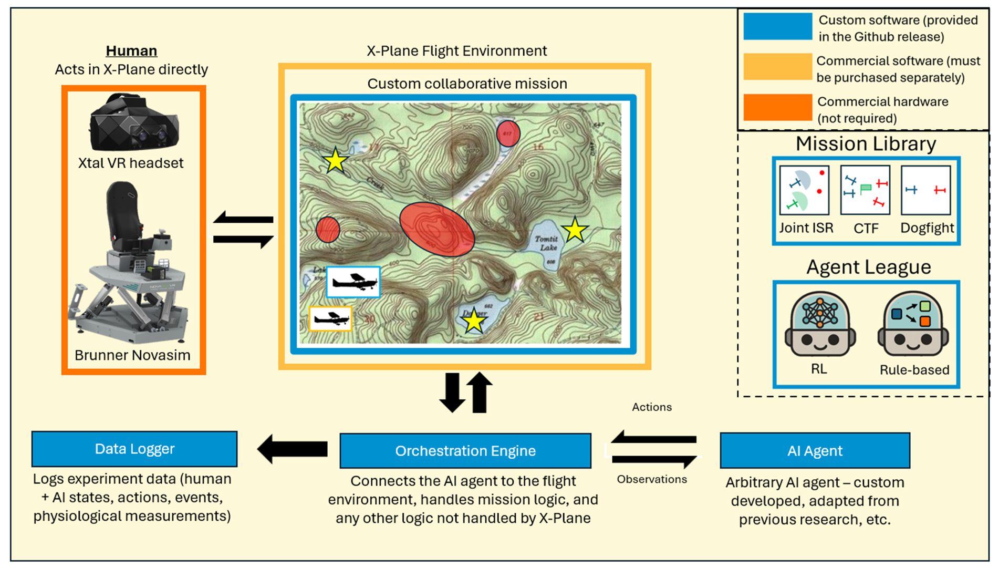
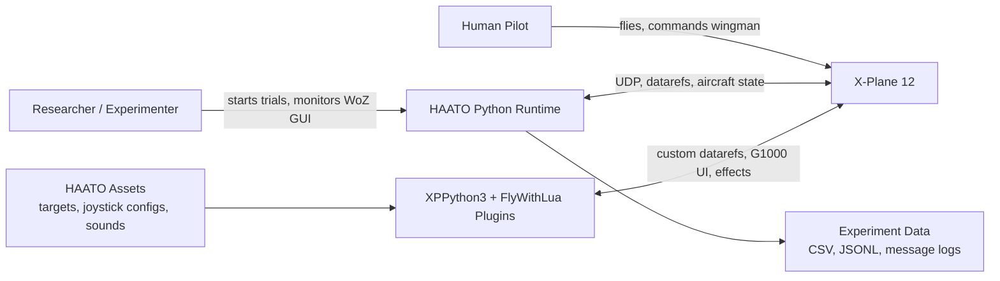
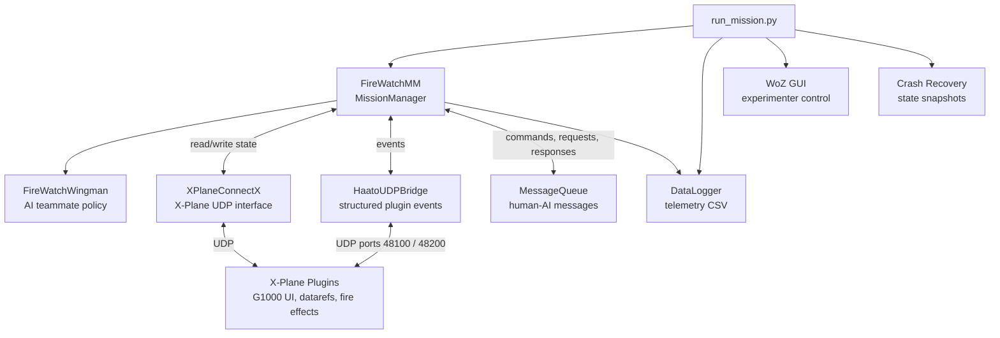
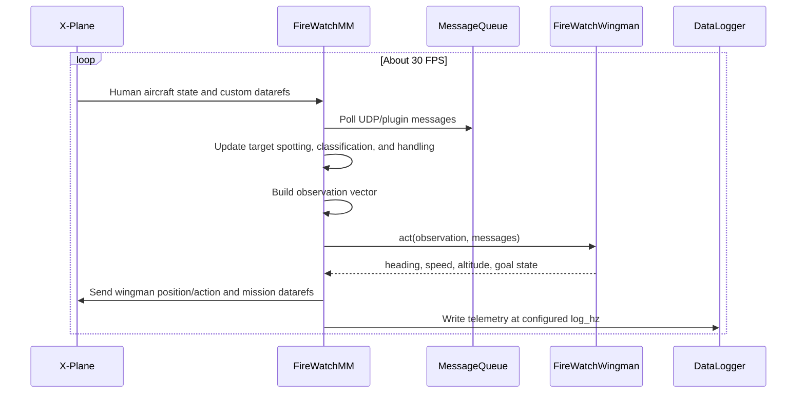
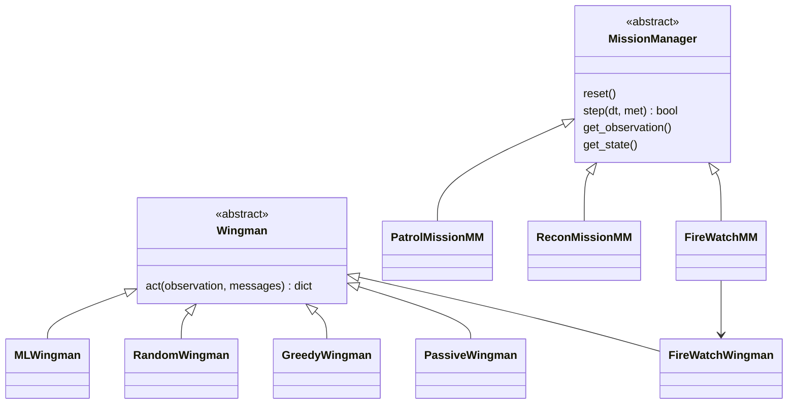

<!-- Project Badges -->


[](#citation)


# HAATO

Human-AI Aerial Teaming Operations (HAATO) is an open-source research testbed for studying human-AI teamwork in simulated aerial missions. It connects Python mission logic, AI wingman policies, custom X-Plane 12 plugins, cockpit displays, voice/joystick interaction, and telemetry logging into a reusable experimental framework.

The current codebase includes multiple aerial teaming missions. **Fire Scouting** is the most mature and thoroughly tested mission because it has been used for the main HAATO experiment, while the Recon Race and ISR Patrol missions are intended to be usable starting points that may need additional validation or refinement for a new study.

HAATO was developed by Ryan Bowers and David Feder at the Georgia Institute of Technology.



## What Is Included

- A runnable Fire Scouting mission for X-Plane 12.
- A rule-based AI wingman with multiple initiative levels.
- Python base classes for building new missions and wingman agents.
- X-Plane plugin assets for custom datarefs, cockpit displays, fire visuals, sounds, and joystick controls.
- Telemetry, message, event, crash-recovery, and analysis utilities.
- Simulated-X-Plane modes and tests for development without a live simulator.
- Additional mission and agent implementations for comparison, extension, and new experiments.

## System Context



## Runtime Architecture



## Mission Loop



## Extension Model



## Requirements

- Python 3.12.
- X-Plane 12.
- XPPython3 4.6.1 or newer.
- FlyWithLua for X-Plane 12.
- Python packages from `requirements.txt`:
  - `numpy`
  - `PyYAML`

Optional voice features use additional speech/TTS dependencies. The core mission and tests do not require those modules.

## Repository Layout

```text
haato-sim/
|-- run_mission.py                  # Main Fire Scouting experiment entry point
|-- run_preflight_planning.py        # Preflight planning utility
|-- requirements.txt
|-- missions/
|   |-- fire/                        # Current Fire Scouting implementation
|   |-- fire_mm.py                   # Compatibility re-export
|   |-- fire_wingman.py              # Compatibility re-export
|   |-- recon_mm.py                  # Competitive recon mission
|   |-- patrol_mm.py                 # Collaborative patrol mission
|   `-- agents.py                    # Reusable baseline wingman agents
|-- utility/                         # Base classes, X-Plane IO, logging, voice, GUI
|-- Copy to X-Plane directory/       # Files to merge into an X-Plane install
|-- tests/                           # pytest suite with fake/simulated X-Plane helpers
|-- data_analysis/                   # Playback and post-analysis tools
|-- docs/                            # Architecture and development documentation
`-- experiment_data/                 # Example/collected experiment outputs
```

## Quick Start

### 1. Install HAATO and Python dependencies

```bash
git clone https://github.com/ryanbowers166/haato.git
cd haato
python -m venv .venv
.venv\Scripts\activate
pip install -r requirements.txt
```

On macOS or Linux, activate the environment with `source .venv/bin/activate`.

### 2. Install X-Plane plugins

1. Install X-Plane 12.
2. Install [FlyWithLua](https://forums.x-plane.org/files/file/82888-flywithlua-ng-next-generation-plus-edition-for-x-plane-12-win-lin-mac/).
3. Install [XPPython3](https://xppython3.readthedocs.io/en/latest/).
4. Copy the contents of `Copy to X-Plane directory/` into your X-Plane 12 installation directory. The folders should merge with X-Plane's existing `Resources`, `Aircraft`, and `Custom Scenery` folders.

Important plugin assets include:

- `Resources/plugins/FlyWithLua/Scripts/custom_datarefs.lua`
- `Resources/plugins/PythonPlugins/PI_firemission.py`
- `Resources/plugins/PythonPlugins/joystick_<control-prefix>.yaml`
- `Resources/plugins/HAATO_assets/config.yaml`
- fire images, splash screens, and sound files in `Resources/plugins/HAATO_assets/`

### 3. Configure X-Plane networking

In X-Plane, enable incoming network connections and UDP data output. HAATO expects local UDP communication with X-Plane, typically using `127.0.0.1`, and the standard XPlaneConnect-style ports configured by the simulator/plugin setup.

For aircraft state output, enable the relevant flight model position and velocity datarefs in X-Plane's data output settings. The screenshot in `docs/xplane_network_settings.png` shows the intended setup.

### 4. Configure joystick controls

Current joystick configs live in `Copy to X-Plane directory/Resources/plugins/PythonPlugins/`.

Included configs:

- `joystick_logitech.yaml`
- `joystick_thrustmaster.yaml`
- `joystick_microsoft.yaml`

For a new joystick, copy an existing config to `joystick_<short-name>.yaml` and update the button IDs. In X-Plane, button IDs can be inspected from `Plugins -> FlyWithLua -> FlyWithLua macros -> Show joystick button numbers`. See `docs/JOYSTICK_SETUP.md` for the full workflow and required button names.

### 5. Run Fire Scouting

Start X-Plane 12, load a flight at Skykomish State Airport, and use an aircraft with at least two G1000 cockpit instruments, such as the Cirrus Vision or Lancair Evolution.

Run a normal mission:

```bash
python run_mission.py -s <subject_id> -t <1|2|3> -c <logitech|thrustmaster|microsoft>
```

Run a practice mission:

```bash
python run_mission.py -s <subject_id> -t 1 --practice <1|2> -c logitech
```

Run without a live X-Plane instance:

```bash
python run_mission.py -s 99 -t 1 -c logitech --simulate_xplane
```

Resume from the latest crash-recovery state:

```bash
python run_mission.py -s <subject_id> -t <trial> -c logitech --resume
```

Run wingman testing mode:

```bash
python run_mission.py -s 99 -t 1 -c logitech --testing_wingman
```

After the mission starts, refresh XPPython3 from the X-Plane plugins menu so the cockpit instruments resync with the Python mission manager. Press `Z` to dismiss the intro screen on the left cockpit display.

## Fire Scouting Mission

Fire Scouting is a 30-minute collaborative aerial firefighting mission. The human pilot and AI wingman coordinate over up to eight fire targets. Targets progress through mission states such as unknown, spotted, in progress, and handled.

This is the most robust HAATO mission today: it has received the most implementation work, has the most test coverage, and was the mission used for the main experiment. The implementation still uses `FireWatch` in several internal class and module names for compatibility.

The AI initiative level changes how much autonomy the wingman exercises:

| Initiative | Behavior |
|------------|----------|
| Low | The wingman waits for human commands and assists with selected targets. |
| Medium | The wingman can suggest alternatives while accepting human overrides. |
| High | The wingman can autonomously select targets while still allowing human override. |

Mission layouts, spawn points, target positions, fire classifications, dynamic fire events, and shared tunables are stored in `Copy to X-Plane directory/Resources/plugins/HAATO_assets/config.yaml`. Splash screens, fire images, and sound assets are also stored under `HAATO_assets/`. Joystick mappings are loaded from YAML files in `Copy to X-Plane directory/Resources/plugins/PythonPlugins/`.

## Mission Library and Agents

HAATO also includes other usable mission and agent implementations. These are part of the framework, but they have not been exercised as heavily as Fire Scouting in live experimental runs, so new studies should validate them against their own protocol before collecting data.

| Component | File | Status |
|-----------|------|--------|
| Fire Scouting | `missions/fire/` | Most mature and experimentally validated mission. |
| Recon Race | `missions/recon_mm.py` | Usable competitive mission; less tested/refined than Fire Scouting. |
| ISR Patrol | `missions/patrol_mm.py` | Usable collaborative patrol mission; less tested/refined than Fire Scouting. |
| Baseline agents | `missions/agents.py` | Passive, greedy, random, and policy-table wingman examples. |
| Search mission example | `examples/search_mission_example.py` | Example extension scaffold. |

## Data and Logging

HAATO writes experiment data for later analysis:

- Time-series telemetry CSV files.
- Human-AI message logs.
- Structured event logs.
- Crash-recovery state snapshots.

The default output locations are `logs/` and `experiment_data/`, depending on the run configuration and logger used.

## Testing

Run the test suite with:

```bash
pytest tests/
```

Many tests use fake or simulated X-Plane interfaces, so they can run without launching X-Plane. Some optional voice-related paths require speech recognition dependencies that are not part of the minimal `requirements.txt`.

## Extending HAATO

To add a mission:

1. Subclass `MissionManager` from `utility/base_classes.py`.
2. Implement `reset()`, `step()`, `get_observation()`, `get_state()`, and mission-progress checks.
3. Define any mission-specific datarefs and plugin assets.
4. Use `examples/search_mission_example.py` and `missions/fire/` as references.

To add a wingman:

1. Subclass `Wingman` from `utility/base_classes.py`.
2. Implement `act(observation, messages) -> dict`.
3. Return heading, speed, altitude, and any mission-specific goal state expected by the mission manager.
4. Use `GeoUtils` for geospatial calculations where possible.

To add cockpit or joystick behavior:

1. Add or update cockpit assets under `Copy to X-Plane directory/Resources/plugins/HAATO_assets/`.
2. Add or update joystick YAML profiles under `Copy to X-Plane directory/Resources/plugins/PythonPlugins/`.
3. Update the relevant FlyWithLua or XPPython3 plugin files.
4. Keep dataref names consistent with the mission manager constants.

## Documentation

- `CLAUDE.md` contains a concise codebase guide for AI coding assistants and maintainers.
- `docs/ARCHITECTURE.md` provides the maintained architecture reference.
- `docs/JOYSTICK_SETUP.md` explains how to configure new joysticks.
- `docs/DATA_POLICY.md` and `docs/RELEASE_CHECKLIST.md` cover public-release hygiene.
- `docs/COMPREHENSIVE_GUIDE.md` is archival and may lag behind the current refactored `missions/fire/` package.
- `dev/` contains refactor notes and cleanup recommendations intended for maintainers.

When in doubt, prefer the current Python implementation over older prose documentation.

## Citation

Citation metadata is provided in `CITATION.cff`. If you use HAATO in research before a formal paper citation is published, please contact the maintainers for the preferred citation format.

## License

HAATO is released under the MIT License. See `LICENSE`.

## Credits

HAATO was developed by [Ryan Bowers](https://scholar.google.com/citations?user=E8sTahoAAAAJ&hl=en) and David Feder at the Georgia Institute of Technology.

HAATO builds on FlyWithLua, XPPython3, and [XPlaneConnectX](https://github.com/sisl/XPlaneConnectX). The banner image for this repository was created using Nano Banana Pro.

## Issues and Questions

Please contact Ryan Bowers at rbowers32@gatech.edu with questions, issues, or suggestions.
